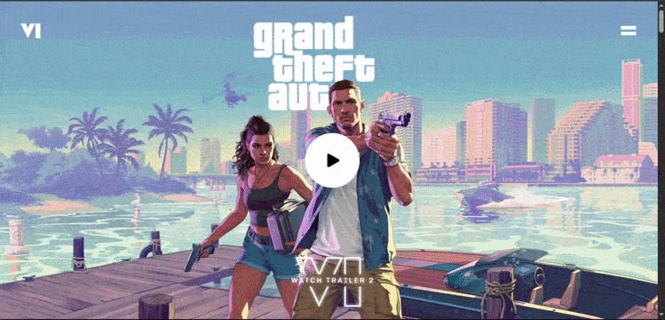

# 🎮 GTA VI — Animated Landing Page

A cinematic, scroll-driven landing page inspired by **Grand Theft Auto VI**. Features buttery-smooth GSAP animations, clip-path transitions, and immersive visual storytelling.



---

A cinematic GTA VI-inspired landing page built with React, TypeScript, Vite, Tailwind CSS, and GSAP. The project focuses on immersive motion, layered visuals, and scroll-driven storytelling to create a promotional game-style landing experience.

## Overview

The page is structured as a sequence of animated sections that introduce the brand, transition through character and video-driven moments, and end with a closing finale. GSAP and ScrollTrigger power the motion design, while React components keep each section isolated and easy to maintain.

## Features

- Full-screen hero section with animated intro content.
- Scroll-triggered transitions between character and video sections.
- GSAP timelines for reveal, pinning, and layered motion effects.
- Modular section components for easy iteration.
- Responsive layout tuned for desktop and mobile viewing.
- Custom fonts, images, and videos stored in the public assets folder.

## Tech Stack

- React 19
- TypeScript
- Vite
- GSAP and @gsap/react
- Tailwind CSS 4
- React Responsive

## Project Structure

```text
src/
  App.tsx
  main.tsx
  index.css
  sections/
    ComingSoon.tsx
    Final.tsx
    FirstVideo.tsx
    Hero.tsx
    Jason.tsx
    Lucia.tsx
    NavBar.tsx
    Outro.tsx
    PostCard.tsx
    SecondVideo.tsx
public/
  fonts/
  images/
  videos/
constants/
  index.ts
```

## Getting Started

### Prerequisites

- Node.js 18 or newer
- npm

### Install Dependencies

```bash
npm install
```

### Start the Development Server

```bash
npm run dev
```

### Build for Production

```bash
npm run build
```

### Preview the Production Build

```bash
npm run preview
```

### Lint the Project

```bash
npm run lint
```

## How It Works

`App.tsx` composes the landing page from a stack of section components. Each section handles its own animation logic with GSAP or `useGSAP`, while shared scroll behavior is managed through `ScrollTrigger`.

Assets live in `public/` so the landing page can reference optimized fonts, images, and videos directly. This keeps the experience visually rich without making the React tree responsible for asset loading logic.

## Notes

- This repository is a front-end showcase and does not include a backend.
- Animations are intentionally opinionated and depend on the provided media assets.
- If you swap assets, some GSAP timings and positions may need tuning.

## Available Scripts

- `npm run dev` starts the Vite dev server.
- `npm run build` type-checks and creates a production bundle.
- `npm run preview` serves the production build locally.
- `npm run lint` runs ESLint across the project.
